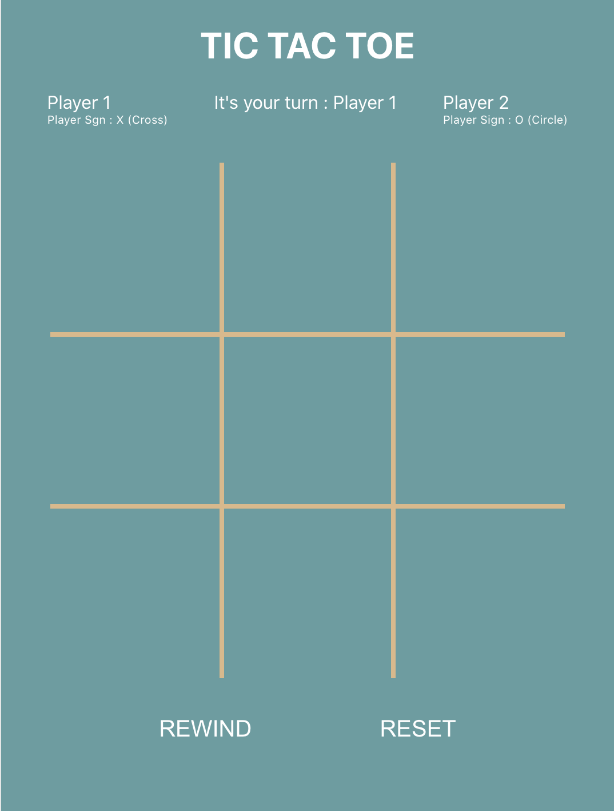

# TIC TAC TOE 

This is a web application for the game of tic tac toe. This web app is developed using react js.

## How to run and play 

You should have node and npm installed on you machine. Then go to the project directory and you can run:

### `npm start`

Runs the app in the development mode.\
Open [http://localhost:3000](http://localhost:3000) to view it in the browser and play the game.

Game board will look like this

